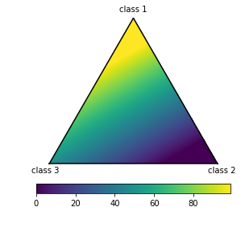
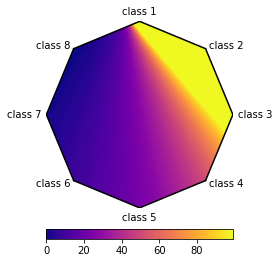

# Multi Bary Plot

A classy way to get a 2-d visualization of n-dimensional data using the generalized barycentric coordinate system.

We use the closest value in barycentric coordinates to color the pixels according to the given values.

## Install

```
pip install git+https://github.com/katosh/multi_bary_plot
```

## Example


```python
from multi_bary_plot.multi_bary_plot import multi_bary_plot
import pandas as pd
```

### 3 Dimensions


```python
# generate data
vec = list(range(100))
pdat = pd.DataFrame({'class 1':vec,
                     'class 2':list(reversed(vec)),
                     'class 3':[50]*100,
                     'val':vec})

# plot
bp = multi_bary_plot(pdat, 'val')
fig, ax, im = bp.plot()
```

    Rasterizing values...
    Filling the convex hull...


    100%|██████████| 250000/250000 [00:48<00:00, 5199.98it/s]





### 8 Dimensions


```python
# generate data
vec = list(range(100))
pdat = pd.DataFrame({'class 1':vec,
                     'class 2':[v**2/10 for v in vec],
                     'class 3':vec,
                     'class 4':vec,
                     'class 5':vec,
                     'class 6':vec,
                     'class 7':[50]*100,
                     'class 8':[50]*100,
                     'val':vec})

# plot
bp = multi_bary_plot(pdat, 'val')
fig, ax, im = bp.plot(cmap='plasma')
```

    Rasterizing values...
    Filling the convex hull...


    100%|██████████| 250000/250000 [00:55<00:00, 4486.69it/s]




