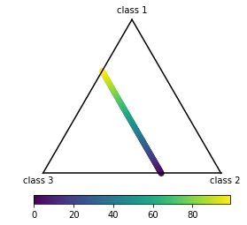

# Multi Bary Plot

A classy way to get a 2-d visualization of n-dimensional data using the generalized barycentric coordinate system.

We use the closest value in barycentric coordinates to color the pixels according to the given values. For each point the dimensions are normalized to a partition of 1 and multiplied with the vertices of the coordinat system defining polygon.

**Note** all dimensions need to be positive for the point to lie within the polygon and at least one dimension needs to have a value other than 0 for the position to be defined.

## Install

```
pip install git+ssh://git@ribogit.izi.fraunhofer.de/Dominik/multi_bary_plot.git
```

## Example


```python
from multi_bary_plot import multi_bary_plot
import pandas as pd
```

### 3 Dimensions


```python
# generate data
vec = list(range(100))
pdat = pd.DataFrame({'class 1':vec,
                     'class 2':list(reversed(vec)),
                     'class 3':[50]*100,
                     'val':vec})

# plot
bp = multi_bary_plot(pdat, 'val')
fig, ax, im = bp.imshow()
```


```python
fig, ax, sc = bp.scatter()
```


```python
fig, ax, ll = bp.plot()
```





### 8 Dimensions


```python
# generate data
import numpy as np
vec = np.pi * np.array(range(201)) / 100
pos = np.sin(vec)+1
pdat = pd.DataFrame({'class 1':pos,
                     'class 2':np.roll(pos, 25),
                     'class 3':np.roll(pos, 50),
                     'class 4':np.roll(pos, 75),
                     'class 5':np.roll(pos, 100),
                     'class 6':np.roll(pos, 125),
                     'class 7':np.roll(pos, 150),
                     'class 8':np.roll(pos, 175),
                     'val':pos*100})
# plot
bp = multi_bary_plot(pdat, 'val')
fig, ax, im = bp.imshow(cmap='plasma')
```


```python
fig, ax, sc = bp.scatter(cmap='plasma')
```


```python
fig, ax, ll = bp.plot()
```


