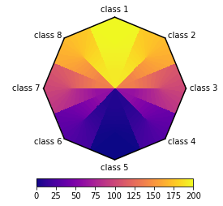

# Multi Bary Plot

A classy way to get a 2-d visualization of n-dimensional data using the generalized barycentric coordinate system.

We use the closest value in barycentric coordinates to color the pixels according to the given values. For each point the dimensions are normalized to a partition of 1 and multiplied with the vertices of the coordinat system defining polygon.

**Note** all dimensions need to be positive for the point to lie within the polygon and at least one dimension needs to have a value other than 0 for the position to be defined.

## Install

```
pip install git+ssh://git@ribogit.izi.fraunhofer.de/Dominik/multi_bary_plot.git
```

## Example


```python
from multi_bary_plot import multi_bary_plot
import pandas as pd
```

### 3 Dimensions


```python
# generate data
vec = list(range(100))
pdat = pd.DataFrame({'class 1':vec,
                     'class 2':list(reversed(vec)),
                     'class 3':[50]*100,
                     'val':vec})

# plot
bp = multi_bary_plot(pdat, 'val')
fig, ax, im = bp.imshow()
```


```python
fig, ax, sc = bp.scatter()
```


```python
fig, ax, ll = bp.plot()
```


### 8 Dimensions


```python
# generate data
import numpy as np
vec2 = np.pi * np.array(range(200)) / 100
pos = np.sin(vec2)+1
ep = np.cos(vec2*8) + 1.4
pdat2 = pd.DataFrame({'class 1':pos**ep,
                      'class 2':np.roll(pos, 25)**ep,
                      'class 3':np.roll(pos, 50)**ep,
                      'class 4':np.roll(pos, 75)**ep,
                      'class 5':np.roll(pos, 100)**ep,
                      'class 6':np.roll(pos, 125)**ep,
                      'class 7':np.roll(pos, 150)**ep,
                      'class 8':np.roll(pos, 175)**ep,
                      'val':pos*100})
# plot
bp2 = multi_bary_plot(pdat2, 'val')
fig, ax, im = bp2.imshow(cmap='plasma')
```


```python
fig, ax, sc = bp2.scatter(cmap='plasma', s=2)
```


```python
fig, ax, ll = bp2.plot()
```





## Further Info


```python
help(multi_bary_plot)
```

    Help on class multi_bary_plot in module multi_bary_plot.multi_bary_plot:
    
    class multi_bary_plot(builtins.object)
     |  This class can turn n-dimensional data into a
     |  2-d plot with barycentric coordinates.
     |  
     |  Parameters
     |  ----------
     |  data : pandas.DataFrame
     |      A column for the values and n columns for the n classes.
     |  value_column : string
     |      The name of the value coumn in `data`.
     |  res : int
     |      The number of pixel along one axes.
     |  n_ticks_colorbar : int
     |      Number of ticks in the optional colorbars.
     |  sign_ticks_colorbar : int
     |      Significant figures of the colorbar ticks.
     |  
     |  Returns
     |  -------
     |  multi_bary_plot : instance
     |      An instance of the multi_bary_plot.
     |  
     |  Usage
     |  -----
     |  vec = list(range(100))
     |  pdat = pd.DataFrame({'class 1':vec,
     |                       'class 2':list(reversed(vec)),
     |                       'class 3':[50]*100,
     |                       'val':vec})
     |  bp = multi_bary_plot(pdat, 'val')
     |  fig, ax, im = bp.plot()
     |  
     |  Methods defined here:
     |  
     |  __init__(self, data, value_column=None, res=500, n_ticks_colorbar=7, sign_ticks_colorbar=2)
     |      Initialize self.  See help(type(self)) for accurate signature.
     |  
     |  draw_polygon(self, ax=None)
     |  
     |  get_ticks(self, values=None)
     |      The ticks in the colorbar.
     |  
     |  imshow(self, colorbar=True, fig=None, ax=None, **kwargs)
     |      Plots the data in barycentric coordinates and colors pixels
     |      according to the closest given value.
     |      
     |      Parameters
     |      ----------
     |      colorbar : bool, optional
     |          If true a colorbar is plotted on the bottom of the image.
     |          Ignored if figure is None and axes is not None.
     |      fig : matplotlib.figure, optional
     |          The figure to plot in.
     |      ax : matplotlib.axes, optional
     |          The axes to plot in.
     |      **kwargs
     |          Other keyword arguments are passed on to
     |          matplotlib.pyplot.imshow.
     |      
     |      Returns
     |      -------
     |      fig, ax, im
     |          The matplotlib Figure, AxesSubplot,
     |          and AxesImage of the plot.
     |  
     |  plot(self, fig=None, ax=None, **kwargs)
     |      Plots the data in barycentric coordinates.
     |      
     |      Parameters
     |      ----------
     |      fig : matplotlib.figure, optional
     |          The figure to plot in.
     |      ax : matplotlib.axes, optional
     |          The axes to plot in.
     |      **kwargs
     |          Other keyword arguments are passed on to
     |          matplotlib.pyplot.plot.
     |      
     |      Returns
     |      -------
     |      fig, ax, ll
     |          The matplotlib Figure, AxesSubplot,
     |          and list of Line2D of the plot.
     |  
     |  scatter(self, color=None, colorbar=None, fig=None, ax=None, **kwargs)
     |      Scatterplot of the data in barycentric coordinates.
     |      
     |      Parameters
     |      ----------
     |      color : bool, optional
     |          Color points by given values. Ignored if no value column
     |          is given.
     |      colorbar : bool, optional
     |          If true a colorbar is plotted on the bottom of the image.
     |          Ignored if figure is None and axes is not None.
     |      fige : matplotlib.figure, optional
     |          The figure to plot in.
     |      ax : matplotlib.axes, optional
     |          The axes to plot in.
     |      **kwargs
     |          Other keyword arguments are passed on to
     |          matplotlib.pyplot.scatter. The keyword argument c
     |          overwrites given values in the data.
     |      
     |      Returns
     |      -------
     |      fig, ax, pc
     |          The matplotib Figure, AxesSubplot,
     |          and PathCollection of the plot.
     |  
     |  ----------------------------------------------------------------------
     |  Data descriptors defined here:
     |  
     |  __dict__
     |      dictionary for instance variables (if defined)
     |  
     |  __weakref__
     |      list of weak references to the object (if defined)
     |  
     |  grid
     |      The grid of pixels to raster.
     |  
     |  hull
     |      The edges of the confex hull for plotting.
     |  
     |  in_hull
     |      A mask of the grid for the part outside
     |      the simplex.
     |  
     |  mgrid
     |      Melted x and y coordinates of the pixel grid.
     |  
     |  plot_values
     |      The Pixel colors masked to the inside of
     |      the barycentric coordinate system.
     |  
     |  points_2d
     |      The 2-d coordinates of the given values.
     |  
     |  text_position
     |      Vertex label positions.
     |  
     |  vertices
     |      The vertices of the barycentric coordinate system.
    

